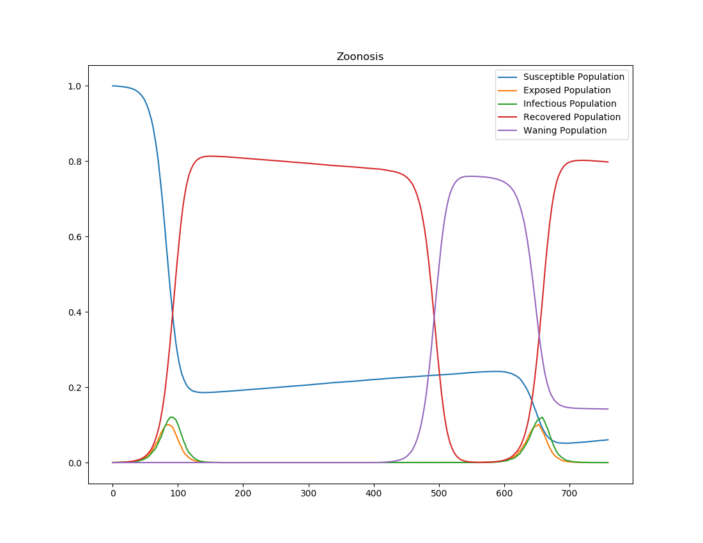

=============================================
Disease outbreaks, reservoirs, and endemicity
=============================================

To configure disease outbreaks in |EMOD_s| simulations, you have a few different options. Generally,
you will configure an outbreak event to occur at some point during the simulation. For zoonotic diseases, you can also introduce the disease through an animal reservoir.

Outbreak events
===============

Somewhat counter-intuitively, disease outbreaks are configured as "interventions" in the
:term:`campaign file`. While the demographics and configuration files specify consistent qualities
of the population or disease, the campaign file is organized into events that occur during the
course of the simulation. Most of these events trigger disease interventions such as vaccinations
and diagnostic tests, but the outbreak is included here as well. Like other interventions,
outbreaks are nested within event coordinators and events, which control when, where, and within
which demographic the outbreak occurs. For more information, see :doc:`model-campaign`.

The two available classes for including a disease outbreak are:

:doc:`parameter-campaign-individual-outbreakindividual`
    This intervention infects existing individuals with a specified disease. You can configure the
    outbreak to occur in individuals that meet certain criteria, such as being high risk.
:doc:`parameter-campaign-node-outbreak`
    This intervention adds new infected individuals to a node or infects existing individuals. You
    cannot specify the demographics of these individuals because the outbreak is at the node level.

Because of the ability to target outbreaks to specific individuals, **OutbreakIndividual** is much
more commonly used. However, you can use either type of outbreak for the scenarios described below.

Emergent outbreak
-----------------

In a population where the disease is not endemic, you will generally include one outbreak in the campaign file. If the population is naive (no immunity), the disease will likely spread. If
the population has immunity, it may not. Immunity may be due to vaccination or, if the disease was
recently endemic, prior infection.

For an example of the effect of vaccination on herd immunity and the spread of an outbreak, see
:doc:`model-campaign`.

Endemic disease
---------------

If the disease is endemic to a region, outbreaks can be periodically repeated to simulate regular
occurrences of the disease in the population. There will likely be some level of immunity within the
population when a disease is endemic.

Alternatively, you can run a simulation for a period of time until the disease dynamics reach
a steady state and disregard simulation output prior to that point. This is known as :term:`simulation burn-in`,
a modeling concept borrowed from the electronics industry where the first items produced by a manufacturing
process are discarded. |EMOD_s| enables you to then serialize the population state at this point
so you can reload in subsequent simulations to analyze the effect of interventions on an endemic
disease. See :doc:`parameter-configuration-setup` for serialization parameters.

Infectivity reservoirs
======================

You can also introduce outbreaks through infectivity reservoirs; for example, zoonotic diseases may
have a background animal reservoir that continuously exposes humans to infection. Zoonotic diseases
are of particular interest because typically they have not previously been in the human population,
making the whole population susceptible.

To configure a simulation with an infectivity reservoir, you must enable  the configuration
parameter **Enable_Infectivity_Reservoir** and configure the demographics parameter
**InfectivityReservoirSize**.  You may also use and configure the demographics parameters
**InfectivityReservoirStartTime** and **InfectivityReservoirEndTime**.

The rate of reservoir-to-human transmission is configured with the parameter **InfectivityReservoirSize** and
human-to-human transmission by the :doc:`parameter-configuration-infectivity` parameters. These values can be
adjusted to shift the disease from a low rate of primary zoonotic infection with substantial
secondary human transmission to a high zoonosis rate with low human transmission. This changes the
fraction of cases that are primary zoonotic infections.

.. TBD add new images 

The following graphs show the :term:`inset chart` and charts for all channels in an outbreak of a
zoonotic disease. To run this example simulation, see the Generic/Zoonosis scenario in the
downloadable `EMOD scenarios`_ zip file. Review the README files there for more information.

After the initial outbreak, there are no additional imported cases set in the campaign file.
However, there are additional introductions from the animal
reservoir, as shown in the log prevalence chart.

   Figure 1: Zoonotic disease outbreak and animal reservoir

.. figure:: ../images/general/Zoonosis_AllCharts_default.png
   :scale: 60%

   Figure 2: All output channels showing re-seeding caused by zoonosis and waning immunity

.. _EMOD scenarios: https://github.com/InstituteforDiseaseModeling/docs-emod-scenarios/releases

