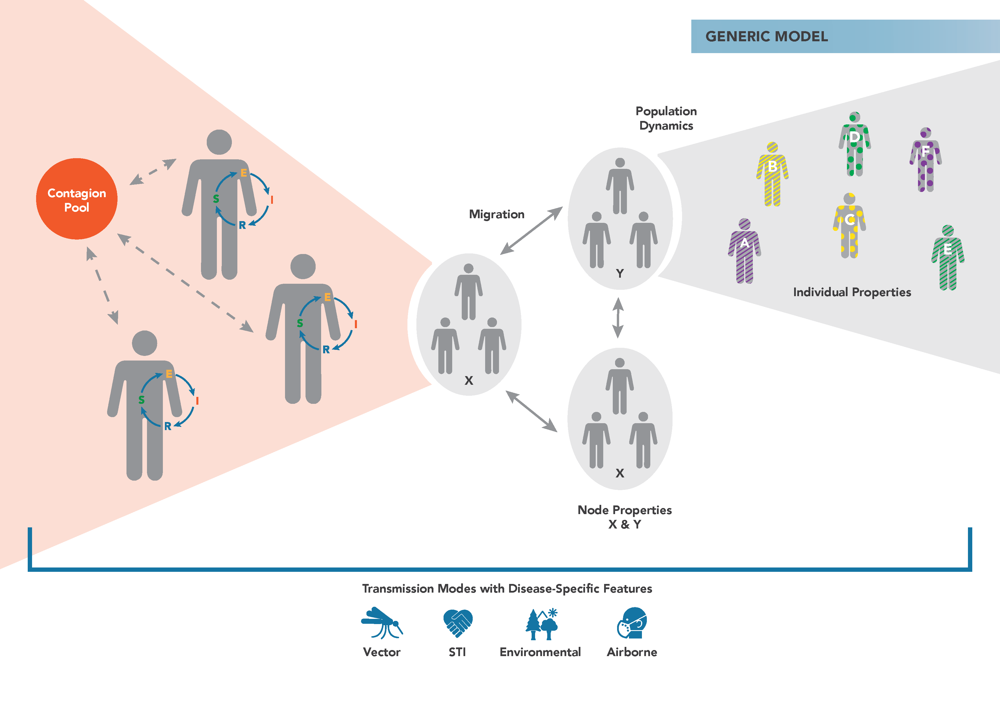

==============
Model overview
==============

.. TODO add link to the general modeling curriculum

Disease models play an important role in understanding and managing the transmission dynamics of
various pathogens. We can use them to describe the spatial and temporal patterns of disease
prevalence, as well as to explore or better understand the factors that influence infection
incidence. Modeling is a key step in understanding what treatments and interventions can be most
effective, how cost-effective these approaches may be, and what specific factors need to be
considered when trying to eradicate disease. The findings can be used to guide
policy for implementing practical real-world solutions.

To understand the complex dynamics underlying disease transmission, epidemiologists often use a set
of models called compartmental models. Developed in the early 20th century, these models stratify a
population into groups, generally based on their risk or infection status. Underlying these models
is a system of differential equations that track the number of people in each category over time.
If you would like a more in-depth introduction to epidemiology and disease modeling, you may want to
take the `Epidemics`_ course from The Pennsylvania State University through Coursera.

Agent-based models
==================

|EMOD_l| is an :term:`agent-based model` (ABM), another powerful tool used to help understand the
complexity inherent in disease transmission systems. |EMOD_s| is a discrete time, :term:`Monte Carlo
method`  simulator that simulates the simultaneous interactions of agents in an effort to recreate
complex phenomena. Each agent (such as a human or vector) can be assigned a variety of properties
(for example, age, gender, etc.), and their behavior and interactions with one another are
determined using decision rules. |EMOD_s| and other ABMs must be run many times to produce
probability distributions of potential outcomes, better capturing uncertainty than compartmental
models.

These models have strong predictive power and are able to leverage spatial and temporal dynamics.
Further, complex environments can be developed in which the agents act, and agents may "learn" from
interactions or "adapt" to their environment. As a result, ABMs are excellent for identifying
emerging properties of the system: patterns that are not explicitly modeled, but instead occur as
a consequence of the rules that govern the agents.

|EMOD_s| can be calibrated to particular geographic locations, and the :term:`microsolver` framework
enables the model's functionality to be highly modifiable. Further, the framework includes the
ability to add intervention campaigns, and those interventions can be specified to target particular
populations or sub-populations of human or vector groups. This intervention targeting is capable of
simulating complex cascade of care systems. |EMOD_s| is
very useful for determining the best intervention strategies to use in particular areas for burden
reduction or elimination.

|EMOD_s| supports different simulation types for various diseases and transmission types. |EMOD_s|
uses a layered architecture in which the base functionality is contained in the generic model and
inherited by the transmission-level models that in turn are inherited by specific disease models.
Because the |EMOD_s| modeling software can simulate all of these diseases, each "model" is more
accurately referred to as a :term:`simulation type`. For more information on the software architecture and
inheritance, see :doc:`software-overview`.

.. figure:: ../images/intro/simulation-types.png

   Simulation type inheritance

.. _Epidemics: https://www.coursera.org/learn/epidemics/home/welcome

The |EMOD_s| generic model forms the foundation for all other disease models in |EMOD_s|. It
provides the fundamental logic for contact-based disease transmission and interventions aimed at
controlling the spread of disease that are targeted to individuals or geographic nodes. You can
easily add heterogeneity to your simulation by configuring he infectivity of the disease,
susceptibility of individuals, and more.

The figure below demonstrates the main components of the generic |EMOD_s| :term:`simulation type`.
Individuals reside in geographic nodes and can migrate from one node to another. Infected
individuals shed contagion into a pool that can infect susceptible individuals. When modeling malaria,
vector and malaria parasite biology is added to the model to simulate disease transmission rather than 
a simple contact-based contagion pool. You can assign
properties to individuals and nodes to vary how interventions are distributed.

The configuration of the model regarding infectivity, immune response, and other qualities is
handled via several :term:`JSON (JavaScript Object Notation)` files. For more information, see
:doc:`software-overview`.

.. toctree::

    vector-model-overview
    malaria-model-overview
    model-outbreak
    model-heterogeneity
    model-campaign
