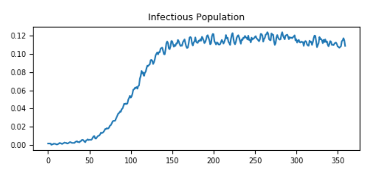
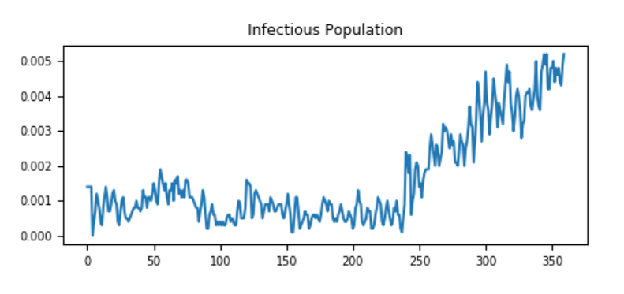
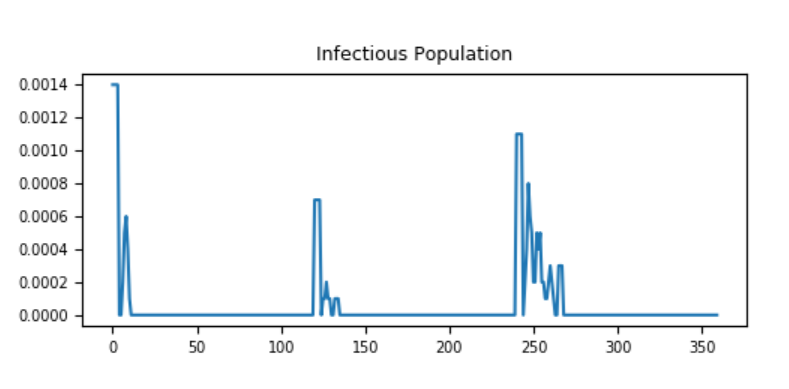

===========================================
Population density and transmission scaling
===========================================

Disease transmission depends on the rate *effective contacts* as represented by parameter
:math:`\beta_0`. But what happens to the effective contact rate as the size of the population
changes? There are two commonly accepted answers: frequency-dependent and density-dependent
transmission scaling.

Frequency-dependent scaling
===========================

By default, |EMOD_s| uses frequency-dependent transmission and the overall transmissibility does not
change with population size or density. An infected individual will infect the same number of people
either in a small village or in a metropolitan area.  For this case,

.. math::

    \text{Transmission} \propto \frac{\text{Number of effective contacts per unit time}}{\text{Current size of the node population}},

so that the transmission rate *inversely proportional* to :math:`N(t)`. The dynamics are frequency-
dependent because the :math:`\beta_0` parameter is divided by the current node population,
:math:`N(t)`.

Density-dependent scaling
=========================

However, when population size is low it's possible that the transmissibility might be
lower and follow density-dependent behavior. Think of a room containing :math:`N` individuals. A
single highly-infectious cough would infect more people if the number of people in the room
(population density) was higher. The number of effective contacts per person per time is
proportional to the population. For this case,

.. math::

    \text{Transmission} \propto \frac{\text{Number of effective contacts per unit time}}{\text{Fixed population size}},

Usually, the denominator is taken as :math:`N(t=0)`, the initial node population. Note that the
transmission rate per capita is a constant in this case. Density-dependent transmission is often
found in SIR models, which inherently neglect the total population size.

Saturating function of population density
=========================================

Based on existing evidence, it is possible that neither a frequency-dependent nor a density-
dependent mechanism may adequately describe the correct scaling over the entire population density
spectrum, but that more closely follows a non-linear scaling function. That is, contact rates tend
to increase with density but saturate at high densities. |EMOD_s| allows the transmission rate to
scale as a saturating function of population density. The force of infection contributed by each
infected individual under these two cases of transmission scaling are as follows:

.. math::

    \text{Force per infected} = \left\{
        \begin{array}{ll}
            \frac{\beta_0}{N} & \text{Frequency dependence} \\
            \left[1 - \exp\left(- \frac{\rho}{\rho_{50}}\right)\right] \frac{\beta_0}{N} & \text{Saturating function of density}
        \end{array}
    \right.

Here, :math:`\rho` is the population density and :math:`\rho_{50}` is an input parameter the governs the
transition from density to frequency dependence. The population density is computed as :math:`\rho =\frac{N}{A}`
where :math:`A` is is the area of the node. This node area is in turn computed from the
longitude and latitude of the node center point (from the demographics file) and the node size. It
is assumed that all nodes have equal size in terms of the degrees of latitude and longitude, as
determined by configuration parameter **Node_Grid_Size**. Denoting this node grid size by :math:`w`,
the area of a node located at (lat, long) is computed based on the corresponding area of a sphere,

.. math::

    A = R^2\Big\lbrace\Big[\text{cos}\Big(\Big(90-\text{lat}-\frac{w}{2}\Big)\frac{\pi}{180}\Big)- \text{cos}\Big(\Big(90-\text{lat}+\frac{w}{2}\Big)\frac{\pi}{180}\Big)\Big]\frac{w\pi}{180}\Big\rbrace,

where :math:`R=6371.2213` km is the radius of Earth.

The saturating function of density is enabled by setting the |EMOD_s| configuration parameter
**Population_Density_Infectivity_Correction** to SATURATING_FUNCTION_OF_DENSITY.
Finally, the :math:`\rho_{50}` parameter is configured using the configuration parameter
**Population_Density_C50**. For more information, see :doc:`parameter-configuration-infectivity` parameters.

This is described in more detail in the article `The scaling of contact rates
with population density for the infectious disease models
<http://www.sciencedirect.com/science/article/pii/S0025556413001235>`__, by Hu *et al*., 2013
*Mathematical Biosciences*. 244(2):125-134. See the figure from that article below.

.. figure:: ../images/general/DensityScaling_orig_cropped.png

  Figure 1: Effect of population density on transmissibility

The Generic/DensityScaling example scenario in the `EMOD scenarios`_ zip file illustrates how population
density can be configured to affect transmission. Review the README files there for more
information.

The table below shows how setting **Node_Grid_Size** in that scenario to 0.1, 0.15, and 0.3 affects
population density and R\ :sub:`0` \ values.

+------------+-------------+------------+----------------+------------+---------+------------------+
| Simulation | Population  | Latitude,  | Node_Grid_Size | Node Area  | Density | R\ :sub:`0`\     |
|            |             | Longitude  |                |            |         |                  |
+============+=============+============+================+============+=========+==================+
|  1         |  10,000     |   0, 0     |  0.1           |  124       |  80     | R\ :sub:`0`\ > 1 |
+------------+-------------+------------+----------------+------------+---------+------------------+
|  2         |  10,000     |   0, 0     |  0.15          |  278       |  36     | R\ :sub:`0`\ ~ 1 |
+------------+-------------+------------+----------------+------------+---------+------------------+
|  3         |  10,000     |   0, 0     |  0.3           |  1112      |  9      | R\ :sub:`0`\ < 1 |
+------------+-------------+------------+----------------+------------+---------+------------------+

The following graphs show the effect of population density on transmissibility, in terms of
maintaining endemic status. When population density is large enough, it is easy to maintain an
endemic status while in lower density is difficult to do so.

   Figure 2: Node_Grid_Size = 0.1, population density 80/km\ :sup:`2`\ and R\ :sub:`0`\  > 1

   Figure 3: Node_Grid_Size = 0.15, population density 36/km\ :sup:`2`\ and R\ :sub:`0`\  ~ 1

   Figure 4: Node_Grid_Size = 0.3, population density 9/km\ :sup:`2`\ and R\ :sub:`0`\  < 1

.. _EMOD scenarios: https://github.com/InstituteforDiseaseModeling/docs-emod-scenarios/releases
