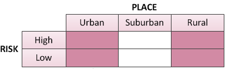
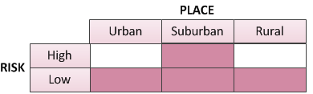
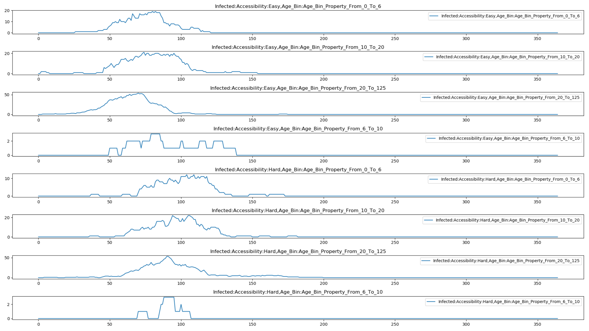
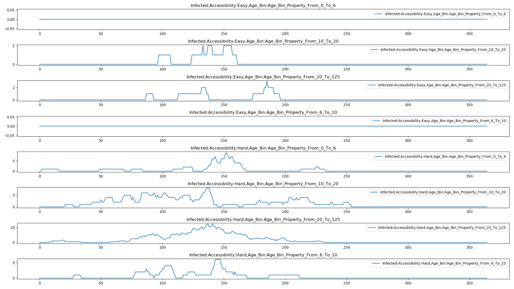

===============================================
Targeting interventions to nodes or individuals
===============================================

Generally, you want to target your outbreaks and campaign interventions to specific regions or
individuals who meet certain criteria. For example, you may want to distribute bednets only to areas
where a mosquito-borne disease is endemic or vaccinate only young children who are at highest risk
of a disease like measles. This topic describes how to distribute interventions to specific
geographic :term:`nodes` or groups of individuals.

Target to nodes based on geography
==================================

Targeting geographic nodes with a particular intervention can be controlled by the **Nodeset_Config**
parameter in the campaign event. You can configure the event to target all nodes, a list of nodes,
or all nodes contained within a defined polygon. For more information, see
:doc:`parameter-campaign-event-campaignevent`.

Target to nodes or individuals using properties
===============================================

To target interventions to particular individuals or nodes based on their property values, you must
first define those properties in the :term:`demographics file` using **IndividualProperties** or
**NodeProperties**. See :ref:`demo-properties` parameters for more information. Then, in the
:term:`event coordinator` in the campaign file, you can target an intervention or outbreak to
particular individuals or nodes based on the properties applied to them. You can target the
intervention based on one or more combinations of property values. For example, you may target
individuals who are both medium risk and easily accessible or high risk and easily accessible. See
:doc:`parameter-campaign-event-coordinators` for all available event coordinators.

Just as defining properties based on age works a little differently than other
properties, targeting an intervention to a particular age range works a little differently than
targeting an intervention to other properties. Note that not all event coordinators support all
of these options.

To target interventions to node properties, use the **Node_Property_Restrictions** parameter to
list the node property key-value pairs that must be assigned to a node for it to receive the intervention.

To target interventions to individual properties, use the **Property_Restrictions_Within_Node**
parameter to  list the individual property key-value pairs that must be assigned to a node for it to
receive the intervention. You may instead use the **Property_Restrictions** parameter, but it does
not support and/or combinations of multiple property values.

To target interventions to age ranges use the **Target_Demographic** parameter. This parameter also
enables targeting based on gender, migration status, women of childbearing age, and other
characteristics.

For more information on the specific parameter values and syntax, see individual event coordinators documented in :doc:`parameter-campaign-event-coordinators`.

Illustrated examples
====================

The following examples illustrate how to target interventions to different groups. This includes how
to configure interventions when there are multiple relevant properties, such as targeting
individuals who are *both* low-risk and in a suburban setting or individuals who are *either* low-
risk or living in suburban settings.

.. these all need to be updated, think about where I want to move the image files--include different examples that show the and/or

Single property, single value
-----------------------------

The following examples show how to target interventions based on a single property value.

This example restricts the intervention to urban individuals.

.. code-block:: json

    {
        "Property_Restrictions_Within_Node": [
            { "Place": "Urban" }
        ]
    }

.. image:: ../images/general/howto-targeted-1.png

Even if you have multiple properties defined in the demographics file, you can target interventions
to a single property value in the same way. Individuals can be assigned any of the values for the
other property types.

In this example, the intervention targets suburban individuals, regardless of their risk.

.. code-block:: json

    {
        "Property_Restrictions_Within_Node": [
            { "Place": "Suburban" }
        ]
    }

.. image:: ../images/general/howto-targeted-2.png

Single property, multiple values
--------------------------------

If you want to individuals with multiple values for the same property type, list the key/value pairs
as separate objects in the array.

In this example, the intervention targets both rural and urban individuals.

.. code-block:: json

    {
      "Property_Restrictions_Within_Node": [
          { "Place": "Rural" },
          { "Place": "Urban" }
      ]
    }

Multiple properties, individuals must match all values
------------------------------------------------------

To target individuals who match particular values defined by multiple property types, list the
key/value pairs in the same object. This is an AND combination.

In this example, a intervention is targeted at low risk, suburban individuals. Individuals must have
both property values.

.. code-block:: json

    {
      "Property_Restrictions_Within_Node": [
          { "Risk": "Low", "Place": "Suburban" }
      ]
    }

.. image:: ../images/general/howto-targeted-4.png

Multiple properties, individuals must match at least one value
--------------------------------------------------------------

However, if you want to target multiple properties, but individuals need to have only one of the
specified values to qualify for the intervention, list the key/value pairs as separate objects. This
is an OR combination.

In this example, the intervention is targeted at individuals who are either low risk or suburban.

.. code-block:: json

    {
      "Property_Restrictions_Within_Node": [
          {"Risk": "Low"},
          { "Place": "Suburban" }
      ]
    }

Target an age range
-------------------

Targeting an intervention to an age range is configured differently than targeting an intervention
to other property types. You have a couple different options.

When individuals must match for both age AND another property, you can use **Target_Demographic** to
limit the age range. To use this method to cover multiple segments using an OR combination requires
you to configure multiple campaign events to cover each segment of the population.

In this example, the intervention is targeted at urban individuals who are also age 0 to 5.

.. code-block:: json

    {
        "Property_Restrictions_Within_Node": [
            { "Place": "Urban" }
        ],
        "Target_Demographic": "ExplicitAgeRanges",
        "Target_Age_Min": 0,
        "Target_Age_Max": 5
    }

.. image:: ../images/general/howto-targeted-6.png

However, to create property value criteria in AND/OR combinations as above, you can use the Age_Bin
property with **Property_Restrictions_Within_Node** instead. |EMOD_s| automatically creates
**Age_Bin_Property_From_X_To_Y** values when you use the **Age_Bin_Edges_In_Years** demographics
parameter.

In this example, the intervention is targeted at individuals 0-5 who are low risk, 5-13 who are
medium risk, or 13-125 who are high risk.

.. code-block:: json

    {
        "Property_Restrictions_Within_Node": [{
                "Risk": "LOW",
                "Age_Bin": "Age_Bin_Property_From_0_To_5"
            },
            {
                "Risk": "MEDIUM",
                "Age_Bin": "Age_Bin_Property_From_5_To_13"
            },
            {
                "Risk": "HIGH",
                "Age_Bin": "Age_Bin_Property_From_13_To_125"
            }
        ]
    }

The following graphs show the property reports for a |HINT_s| simulation with both age and
accessibility properties in which transmission is lower for hard-to-access individuals and there are an equal number of "easy" and "hard" to access individuals. The first graph shows the effect of targeting
vaccination to children aged 6 to 10. The second graph shows the effect of instead targeting it to
all individuals who are easy to access.

To run this example simulation, see the Generic/HINT_AgeAndAccess scenario in
the downloadable `EMOD scenarios`_ zip file. Review the README files there for more information.

   Figure 1: Age-targeted vaccination

In this example, the outbreak begins in the easily accessible population and vaccination is targeted
to children aged 6 to 10. Notice the dramatic decrease of the infection in 6 to 10 year olds due to
the vaccination of this group. Compare infections in other ages, noting the overall decrease in
infection across age groups even though only 6 to 10 year olds were vaccinated.

   Figure 2: Access-targeted vaccination

In this example, the outbreak begins in the inaccessible population and vaccination is targeted to
all individuals who are easily accessed. Notice how the infection is almost entirely eliminated
among the easily accessible population, but there is only a slight reduction in infection among the
inaccessible population that was not reached by the vaccination campaign.

.. _EMOD scenarios: https://github.com/InstituteforDiseaseModeling/docs-emod-scenarios/releases