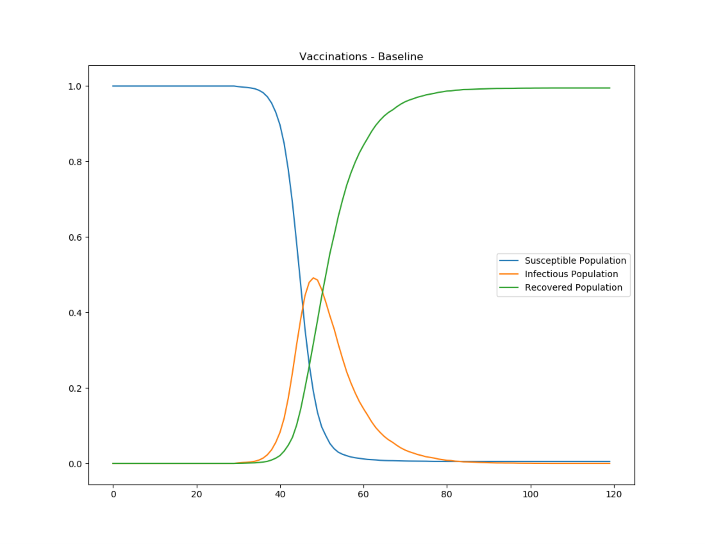
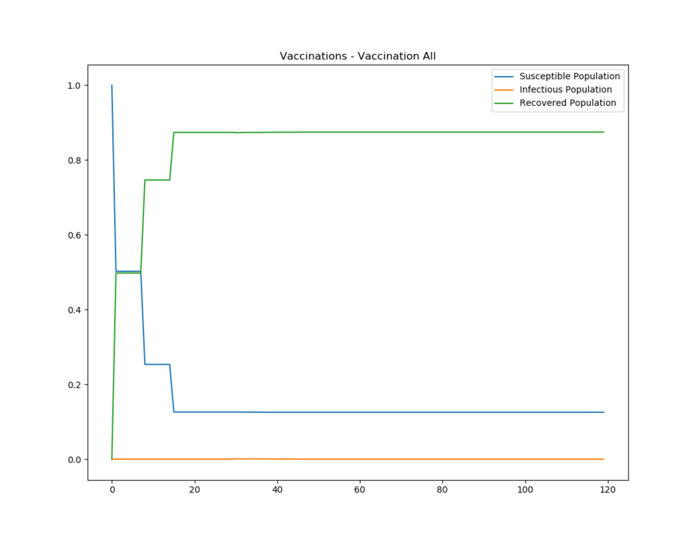
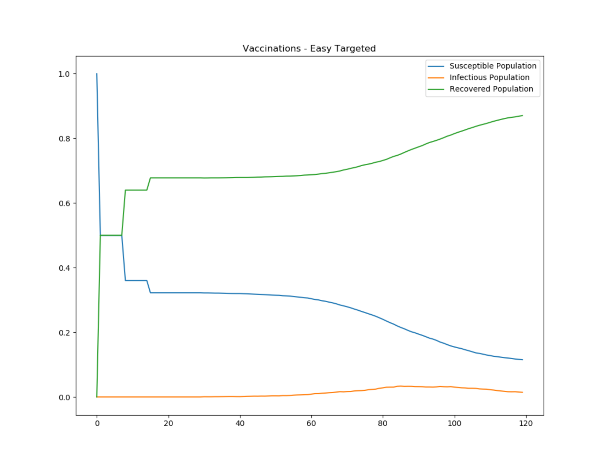

=============================
Vaccination and herd immunity
=============================

In a basic compartmental model, we often assume all individuals are
susceptible before the importation of an outbreak. However, vaccination is one of the most
effective ways to prevent or contain a disease outbreak.

Starting from the traditional SIR equation:

.. math::

        \begin{aligned}
        \frac{dS}{dt} & = -\frac{\beta SI}{N}\\
        \frac{dI}{dt} & = \frac{\beta SI}{N} - \gamma I\\
        \frac{dR}{dt} & = \gamma I
        \end{aligned}

For an outbreak to start, the following condition needs to be satisfied:

.. math::

        \frac{dI}{dt} = \frac{\beta SI}{N} - \gamma I > 0

If a vaccination :term:`campaign` with coverage p :math:`\in` [0, 1] is performed before the
outbreak, a fraction of susceptible people move to the recovered compartment. If the vaccine
take is e :math:`\in` [0, 1], representing the probability of being protected after receiving a
vaccine dose, the fraction of immune people due to vaccination is *ep*. Therefore, the previous
condition can be reduced to:

.. math::

        \begin{aligned}
        \left(\beta (1 - e p) - \gamma\right) I  & > 0\\
        R_0 (1 - e p) & > 1\\
        R_{eff} & > 1
        \end{aligned}

R\ :sub:`eff`\  is also called the effective reproductive number. Vaccination can reduce the
disease's ability to spread, and the outbreak can be prevented or stopped with less than 100%
coverage. When R\ :sub:`eff`\ = 1,  there exists a minimum vaccination coverage that can prevent a
disease outbreak. This minimum coverage required to prevent an outbreak is usually called
:term:`herd immunity` (represented as P\ :sub:`herd`\).  Therefore, the analytical form of
P\ :sub:`herd`\  can be derived based on the previous condition:

.. math::

        P_{herd} = \frac{1}{e}\left(1-\frac{1}{R_0}\right)

Multiple rounds of vaccinations
===============================

If multiple vaccine interventions are performed in the same area, people are selected on a binomial
basis and all individuals have the same probability of being included. If the vaccine coverage is p,
every individual has a probability *p* of being selected in a given round. After the first round,
the fraction of non-vaccinated is 1-*p*, and after *n* rounds this fraction is (1 - p)\ :sup:`n`\.
Therefore, the fraction of people getting at least 1 dose is:

.. math::

        1-(1-p)^n

For example, the fraction of people getting at least one vaccination with a 50% campaign coverage is
shown in the following table. After a few rounds, the coverage increases significantly with the
number of campaigns.

+---------------------+-------------------------------+
| Number of campaigns | Covered percentage (>=1 dose) |
+=====================+===============================+
| 1                   | 50%                           |
+---------------------+-------------------------------+
| 2                   | 75%                           |
+---------------------+-------------------------------+
| 3                   | 87.5%                         |
+---------------------+-------------------------------+
| 4                   | 93.75%                        |
+---------------------+-------------------------------+
| 5                   | 96.875%                       |
+---------------------+-------------------------------+

For an example simulation, see the Generic/Vaccinations scenario in the downloadable `EMOD scenarios`_
zip file. Review the README files there for more information.

The following graphs show a baseline SIR outbreak and then the effect of a vaccination campaign
distributed to the entire population. The vaccination campaign is repeated three times, seven days
apart. The vaccine has 100% take and 50% demographic coverage. With this configuration, the fraction
of immune people is above herd immunity and the outbreak does not spread.

   Figure 1: Baseline SIR outbreak

   Figure 2: Broad vaccination campaign achieving herd immunity

However, this is usually not the case. In recent polio eradication campaigns, the number of
:term:`supplemental immunization activity (SIA)` campaigns planned in certain high-risk districts is greater
than 6 per year, but poliovirus still persists in the area due to certain groups that are
chronically missed. This can be caused by low accessibility, exclusion from SIA microplans, or
vaccine refusal. R\ :sub:`eff`\  has not been driven below 1 because these susceptible people in the
chronically missed groups are still in contact with the rest of population. In some modeling
simulations, this assumption has to be included.

In this second example, the same 50% campaign coverage is repeated so that the same amount of
vaccine is used. However, 30% of the population is not accessible to any vaccine campaigns. Although
the number of vaccine doses used is the same as the previous example, the overall coverage is much
lower. Creating campaigns that target interventions  is described in more detail in
:doc:`model-targeted-interventions`.

+------------+---------------------+-----------------------+-----------------------+
| Number of  | Covered percentage  | Covered percentage    | Covered percentage of |
| campaigns  | of total population | of groups with access | groups without access |
+============+=====================+=======================+=======================+
| 1          | 50%                 | 71.43%                | 0%                    |
+------------+---------------------+-----------------------+-----------------------+
| 2          | 59%                 | 91.84%                | 0%                    |
+------------+---------------------+-----------------------+-----------------------+
| 3          | 68.37%              | 97.67%                | 0%                    |
+------------+---------------------+-----------------------+-----------------------+
| 4          | 69.53%              | 99.33%                | 0%                    |
+------------+---------------------+-----------------------+-----------------------+
| 5          | 69.87%              | 99.81%                | 0%                    |
+------------+---------------------+-----------------------+-----------------------+

The following graph shows the same SIR outbreak when 30% of the population is chronically
missed by the vaccination campaign, allowing the outbreak to persist.

   Figure 3: Vaccination campaign that misses 30% of the population

.. _EMOD scenarios: https://github.com/InstituteforDiseaseModeling/docs-emod-scenarios/releases
