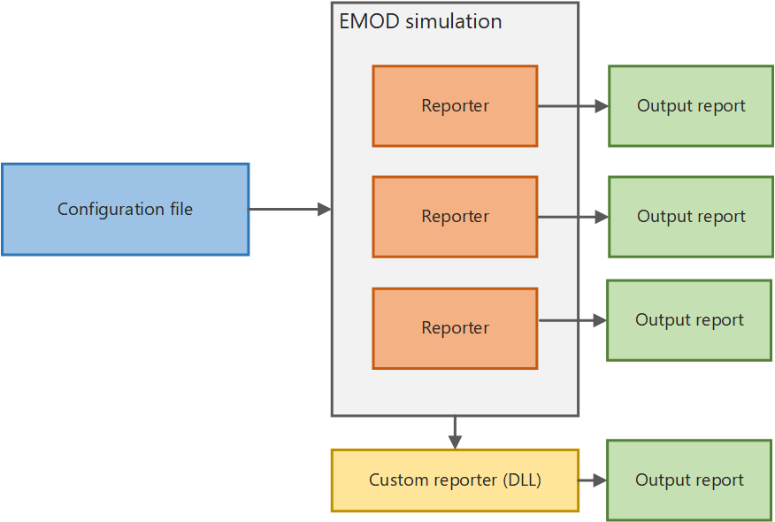

======================
Output files (reports)
======================

After the simulation finishes, a :term:`reporter` extracts simulation data, aggregates it, and
outputs it to a file (known as an :term:`output report`). Most of the reports are also JSON files,
the most important of which is InsetChart.json. The InsetChart.json file provides simulation-wide
averages of disease prevalence at each :term:`time step`.

After running a simulation, the simulation data is extracted, aggregated, and saved as an
:term:`output report` to the output directory in the working directory. Depending on your
configuration, one or more output reports will be created, each of which summarize different data
from the simulation. Output reports can be in JSON, CSV, or binary file formats. |EMOD_s| also
creates logging or error output files.

The |EMOD_s| functionality that produces an output report is known as a :term:`reporter`. |EMOD_s|
provides several built-in reporters for outputting data from simulations. By default, |EMOD_s| will
always generate the report InsetChart.json, which contains the simulation-wide average disease
prevalence by :term:`time step`. If none of the provided reports generates the output report that
you require, you can create a custom reporter.

If you want to visualize the data output from an |EMOD_s| simulation, you must use graphing
software to plot the output reports. In addition to output reports, |EMOD_s| will generate error
and logging files to help troubleshoot any issues you may encounter.

Using output reports
====================

By default, the output report InsetChart.json is always produced, which contains per-
time step values accumulated over the simulation in a variety of reporting channels, such as new infections, 
prevalence, and recovered. |EMOD_s| provides several other
built-in reports that you can produce if you enable them in the :term:`configuration file`
with the :doc:`parameter-configuration-output` parameters. Reports are generally in JSON or CSV format.
If none of the built-in output reports provide the data you need, you can use a custom reporter that
plugs in to the |exe_s| as an |module| :term:`dynamic link library (DLL)`. For more information, see
:doc:`software-custom-reporter`.

In order to interpret the output of |EMOD_s| simulations, you will find it useful to parse the output
reports into an analyzable structure. For example, you can use a Python or MATLAB script to create graphs
and charts for analysis.

Convert output to CSV format
----------------------------

Most output reports, including the primary InsetChart report, are in JSON format. If you are using R
for data analysis, you may prefer a CSV report. You can easily convert the output format using
Python post-processing using the icjjson2csv.py_ script provided in the |EMOD_s| GitHub repository.
Provide the path to this script using the ``-P`` argument when you run |exe_s| at the command line.
See :doc:`software-simulation-cli` for more information.

Use Python to plot data
-----------------------

The example below uses the Python package JSON_ to parse the file and the Python package
`matplotlib.pyplot`_ to plot the output. This is a very simple example and not likely the most robust
or elegant. Be sure to set the actual path to your working directory.

.. code-block:: python

    import os
    import json
    import matplotlib.pyplot as plt

    # open and parse InsetChart.json
    ic_json = json.loads( open( os.path.join( WorkingDirectoryLocation, "output", "InsetChart.json" ) ).read() )
    ic_json_allchannels = ic_json["Channels"]
    ic_json_birthdata = ic_json["Channels"]["Births"]

    # plot "Births" channel by time step
    plt.plot( ic_json_birthdata[  "Data"  ], 'b-' )
    plt.title( "Births" )
    plt.show()

Use MATLAB to plot data
-----------------------

The example below uses the MATLAB toolbox JSONlab_ to parse an InsetChart.json file and plot one channel.
This script uses JSONLab to parse the file into a usable form in MATLAB. This is a very simple
example and not likely the most robust or elegant. Be sure to set the actual paths to JSONlab and
your working directory.

.. code-block:: matlab

    % this sample uses JSONLab toolbox
    addpath('PATH TO/jsonlab');

    % open and parse InsetChart.json
    ic_json = loadjson( fullfile( 'WorkingDirectoryLocation', 'output', 'InsetChart.json' ));
    ic_json_allchannels = ic_json.Channels;
    ic_json_birthinfo = ic_json_allchannels.Births;
    ic_json_birthdata = ic_json_birthinfo.Data;
    M = num2cell(ic_json_birthdata);

    % plot "Births" channel by time step
    plot(cell2mat(M));
    title( 'Births' );

.. _JSON: http://docs.python.org/library/json.html
.. _matplotlib.pyplot: http://matplotlib.org/api/pyplot_api.html
.. _JSONlab: http://www.mathworks.com/matlabcentral/fileexchange/33381-jsonlab-a-toolbox-to-encodedecode-json-files-in-matlaboctave
.. _icjjson2csv.py: https://github.com/InstituteforDiseaseModeling/EMOD/blob/master/Regression/Python/icjjson2csv.py

.. toctree::
    :maxdepth: 3
    :titlesonly:

    software-custom-reporter
    software-error-logging
    software-report-binned
    software-report-demographic-summary
    software-report-inset-chart
    software-report-property
    software-report-event-counter
    software-report-event-recorder
    software-report-human-migration
    software-report-node-demographics
    software-report-spatial

.. toctree::
   :maxdepth: 3
   :titlesonly:

   software-report-vector-genetics
   software-report-vector-migration
   software-report-vector-stats
   software-report-vector-habitat
   software-report-vector-species
   software-report-malaria-immunity
   software-report-malaria-patient
   software-report-malaria-sql
   software-report-malaria-summary
   software-report-malaria-survey
   software-report-drug-status
   software-report-filtered-malaria
   software-report-malaria-node-demographics
   software-report-malaria-node-demographics-genetics
   software-report-simple-malaria-transmission
   software-report-vector-stats-malaria-genetics
   software-report-malaria-spatial
   software-report-intervention-population-average

.. added this way even though it adds a blank link in the toc links because it's safer--
.. if new built-in reports are added to generic, we can update only the generic file instead
.. of all files that inherit from it.

.. Need to double check, but software-report-human-migration, software-report-event-counter and software-report-node-demographics
.. may need to go into the generic toc

.. make sure order of reports makes sense