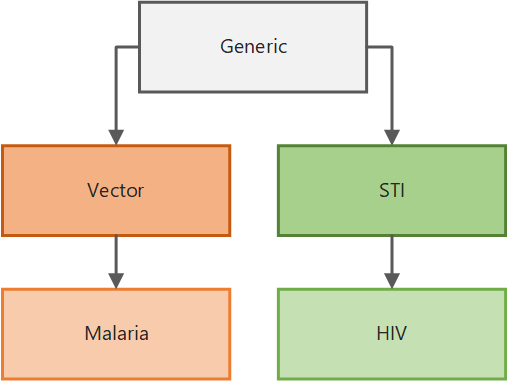
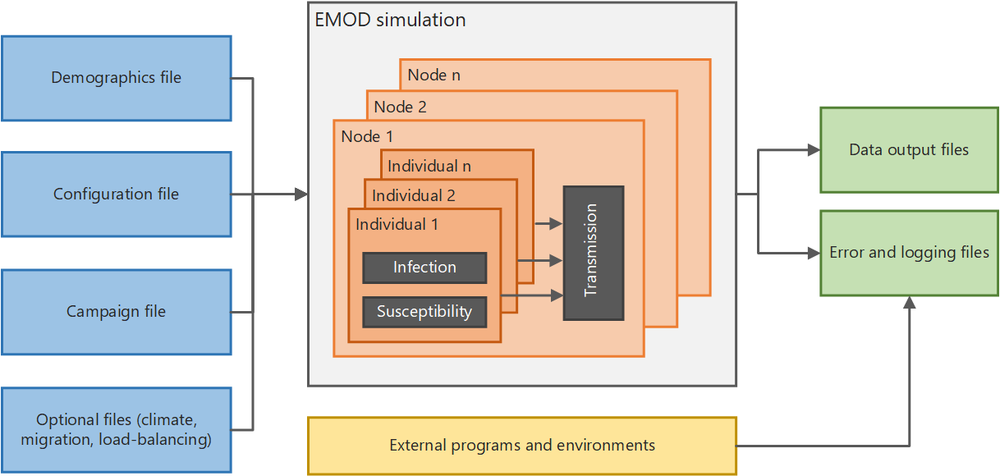

=============================
Overview of |EMOD_s| software
=============================

The |IDM_l| develops detailed simulations of disease transmission through the use of quantitative software modeling. The agent-based model, |EMOD_l|, helps determine the combination of health
policies and intervention strategies that can lead to disease eradication. |EMOD_s| calculates how
diseases may spread in particular areas and is used to analyze the effects of current and future
health policies and intervention strategies. It supports infectious disease campaign planning, data
gathering, new product development, and policy decisions. |IDM_s| shares this modeling software with the
research community to advance the understanding of disease dynamics.

|EMOD_s| is quite different from a :term:`deterministic` :term:`compartmental model`, which uses an
:term:`ordinary differential equation (ODE)` to determine the rates at which proportions of the
population move from each compartment (or disease state) to another. |EMOD_s| is an
:term:`agent-based model` (ABM) that simulates the simultaneous interactions of agents in an effort
to recreate complex phenomena. Each agent, whether it is a human or a vector, can be assigned a variety of
properties to represent age, gender, parasite density, and much more. Their behavior and
interactions with one another are determined by using decision rules based on their properties.
These models have strong predictive power and are able to leverage spatial and temporal dynamics.

|EMOD_s| is also :term:`stochastic`, meaning that there is randomness built into the model.
Infection and recovery processes are represented as probabilistic Bernoulli random draws. In other
words, when a susceptible person comes into contact with a pathogen, they are not guaranteed to
become infected. Instead, you can imagine flipping a coin that has a λ chance of coming up tails
S(t) times and every person who gets a head is considered infected. This randomness better
approximates what happens in reality. It also means that you must run many simulations to determine
the probability of particular outcomes.

Simulation types
================

.. include:: ../reuse/sim-types.txt

The illustration below shows how the simulation types are built upon one another. With a few
exceptions, all parameters available to configure the simulation in the generic :term:`simulation type`
are inherited by the vector simulation type. The vector simulation type adds additional
parameters specific to the biology of vector-borne diseases, which in turn are inherited by the
malaria simulation type, which adds parameters specific to malaria biology and treatment, and so on. Therefore, depending on the simulation type you select, different
parameters are available for you to use. In addition, simulation types for broader classes of
disease can be extended to build your own disease-specific model.

   Simulation type inheritance

|EMOD_s| utilizes object-oriented programming design principles such as interfaces, factories, and
observers to achieve a highly modular architecture, thus enabling comparisons of structural
assumptions and different levels of model detail. For example, parameters specific to the intrahost
biology of disease progression and to behavioral propensities that drive health care seeking have been
separated into different inheritance classes. Thus, modules or sub-modules can be interchanged while
leaving other portions of the model intact.

|EMOD_s| can produce statistically significant results over a broad set of parameters and scenarios.
One strength of |EMOD_s| is the ability to incorporate interventions aimed at controlling or
eradicating disease. Quantitative analysis of the simulated output enables disease eradication
efforts to be more driven by data. The |IDM_s| research team has published many articles
related to modeling and the modeling concepts underpinning |EMOD_s|. For a list of published
articles, see `IDM Publications`_.

This section provides an overview of |EMOD_s| and files needed to run simulations. The architecture
diagram below shows, at a high level, how the system functions. If you run simulations in parallel
on a multi-node cluster, there is also a Message Passing Interface (MPI) component used to pass data
between multiple instances of |EMOD_s|.

   High-level |EMOD_s| system architecture

.. I think this would be a great place to add interactive elements or even just a simple
.. Plinko gif to help illustrate the type of model we use

.. toctree::
   :maxdepth: 2
   :titlesonly:

   software-inputs
   software-run-simulation
   software-serializing-pops
   software-outputs

.. _IDM Publications: http://idmod.org/publications