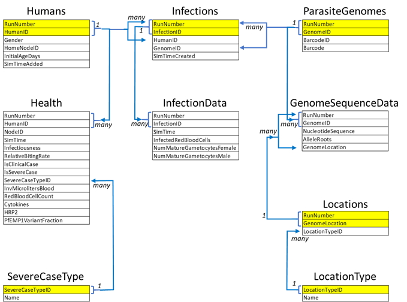

================
MalariaSQLReport
================

The MalariaSQL report outputs epidemiological and transmission data. Because of the quantity and
complexity of the data, the report output is a multi-table SQLite relational database (see `DB
Browser for SQLite <https://sqlitebrowser.org/>`_ for more information). Use the configuration
parameters to manage the size of the database.

Configuration
=============

To generate this report, configure the following parameters in the custom_report.json file:

.. csv-table::
    :header: Parameter, Data type, Min, Max, Default, Description
    :widths: 8, 5, 5, 5, 5, 20

    **Include_Drug_Status_Table**, boolean, NA, NA, 0, "A true value (1) includes the table that provides data at each time step for each drug the person has."
    **Include_Health_Table**, boolean, NA, NA, 1, "A true value (1) includes the Health table which has data for each time step for the health of an individual."
    **Include_Infection_Data_Table**, boolean, NA, NA, 1, "A true value (1) includes the InfectionData table which has data for each time step for each active infection."
    **End_Day**, float, 0, 3.40E+38, 3.40E+38, "The day to stop collecting data for the report."
    **Start_Day**, float, 0, 3.40E+38, 0, "The day to start distributing interventions."

.. code-block:: json

    {
        "Reports": [
            {
                "Include_Drug_Status_Table": 1,
                "Include_Health_Table": 1,
                "Include_Infection_Data_Table": 1,
                "Start_Day": 100,
                "End_Day": 900,
                "class": "MalariaSQLReport"
            }
        ],
        "Use_Defaults": 1
    }

SQL database and table structures
=================================

Because the output is a relational database, most of the tables have a primary key (highlighted in
yellow on the figure below) that is a combination of RunNumber and another value. For example, in
the Humans table, the primary key is the combination of RunNumber and HumanID. Because the RunNumber
is part of the primary key, you can combine data from multiple runs.

The following chart and tables describe the SQL data tables produced by this report. The “many” and
“1” notations in the chart show you which tables have a one-to-many row relationship and which have
a many-to-one row relationship with the rows in another table.

    Schematic of the SQL data tables produced by this report

Humans table
============

The Humans table tracks of all the humans in the simulation. It contains one row for each individual
in the scenario. This table has a one-to-many relationship with the Infections and Health tables.

.. csv-table::
    :header: ColumnName, Data type, Description
    :widths: 15, 10, 40

    RunNumber, integer, This value from the **Run_Number** parameter is the seed to the model's random number generator.
    HumanID, integer, The unique ID of the individual in the simulation.
    Gender, text, "The gender of the individual. Possible values are M or F."
    HomeNodeID, integer, "The external ID (NodeID in demographics) of the home node where the individual starts out."
    InitialAgeDays, float, "The age, in days, of the individual when they entered the simulation."
    SimTimeAdded, float, "The time in the simulation when the individual was added."

Health table
============

The Health table tracks the health of each individual while they are alive in the simulation. There
is one record for each timestep during which an individual was alive. This table has a many-to-one
relationship with the Humans table. Query the SevereCaseType table if you want to translate the
integer value of ServerCaseTypeID to a text value.

.. csv-table::
    :header: ColumnName, Data type, Description
    :widths: 15, 10, 40

    RunNumber, integer, This value from the **Run_Number** parameter is the seed to the model's random number generator.
    HumanID, integer, The unique ID of the individual in the simulation.
    NodeID, integer, The external ID of the node the individual is in at this time.
    SimTime, float, The time in the simulation that this data was collected.
    Infectiousness, float, An infectiousness value based on the individual's number of mature female gametocytes and fever status.
    RelativeBitingRate, float, "A number indicating if this individual is more likely to be bitten by mosquitoes. This can include any biting rates you set and/or a value based on the age/area of the individual."
    IsClinicalCase, boolean, "A value of true (1) means that the individual has a fever greater than both **Clinical_Fever_Threshold_Low** and **Clinical_Fever_Threshold_High**."
    IsSevereCase, boolean, "A value of true (1) means the individual has a fever greater than **Clinical_Fever_Threshold_Low** and was probabilistically determined to have severe disease."
    SevereCaseTypeID, integer, The unique ID of the type of severe disease.
    InvMicrolitersBlood, float, The inverse amount of blood the individual has in microliters.
    RedBloodCellCount, float, The actual number of red blood cells the individual has.
    Cytokines, float, The number of cytokines that have been stimulated by the presence of all malaria parasites.
    HRP2, float, The amount of Histidine Rich Protein 2 in the individual's blood stream.
    PfEMP1VariantFraction, float, "The number of PfEMP1 antibodies that an individual has divided by the total number possible in the scenario (**Falciparum_PfEMP1_Variants**)."

SevereCaseType table
====================

This is a small, lookup table for translating the integer value of SevereCaseTypeID in the Health
table into the actual name of the case type. The SevereCaseType names are based on the
**SevereCaseTypesEnum** parameter.

.. csv-table::
    :header: ColumnName, Data type, Description
    :widths: 15, 10, 40

    SevereCaseTypeID, integer, The unique ID of the severe case type.
    Name, enum, "The name of the cause of the sever disease. Possible values are NONE, ANEMIA, PARASITES, or FEVER."

Infections table
================

The Infections table tracks the infections that occurred in humans during the simulation. There is
one row for each infection that occurred. This table has a many-to-one relationship with the
Infections and ParasiteGenomes tables.

.. csv-table::
    :header: ColumnName, Data type, Description
    :widths: 15, 10, 40

    RunNumber, integer, "This value from the **Run_Number** parameter is the seed to the model's random number generator."
    InfectionID, integer, The unique ID of the infection in the simulation.
    HumanID, integer, The unique ID of the individual in the simulation.
    GenomeID, integer, The unique ID of the genome derived from a hash code function on the nucleotide sequence of the genome.
    SimTimeCreated, float, The time in the simulation that the infection was created.

InfectionData table
===================

The InfectionData table contains data about each infection while it was active in the simulation.
This table has a one-to-many relationship with the Infections table.

.. csv-table::
    :header: ColumnName, Data type, Description
    :widths: 15, 10, 40

    RunNumber, integer, "This value from the **Run_Number** parameter is the seed to the model's random number generator."
    InfectionID, integer, The unique ID of the infection in the simulation.
    SimTime, float, The time in the simulation that this data was collected.
    InfectedRedBloodCells, integer, The number of infected red blood cells due to this infection at this time.
    NumMatureGametocytesFemale, integer, The number of mature female gametocytes in this infection at this time.
    NumMatureGametocytesMale, integer, The number of mature male gametocytes in this infection at this time.

ParasiteGenomes table
=====================

The ParasiteGenomes table contains one row of information about each unique parasite genome. This
table has a one-to many relationship with the GenomeSequenceData and Infections tables.

.. csv-table::
    :header: ColumnName, Data type, Description
    :widths: 15, 10, 40

    RunNumber, integer, "This value from the **Run_Number** parameter is the seed to the model's random number generator."
    GenomeID, integer, The unique ID of the genome derived from a hash code function on the nucleotide sequence of the genome.
    BarcodeID, integer, "The unique ID/hash of the barcode portion of the genome, based just on the barcode. It does not include the allele roots."
    Barcode, string, "The text representation of the barcode where each allele is A, C, G, or T."

DrugStatus table
================

The DrugStatus table keeps track of the status of each drug in a person. Each person may have multiple records
per time step, so the table may be large. Information on each drug will continue until the drug has expired.

.. csv-table::
    :header: ColumnName, Data type, Description
    :widths: 15, 10, 40

    RunNumber, integer, "This value from the **Run_Number** parameter is the seed to the model's random number generator."
    HumanID, integer, "The unique ID of the person in the simulation."
    SimTime, float, "The time in the simulation that the data is being collected."
    DrugName, string, "The name of the drug indicated in the intervention as defined by the configuration parameter **Malaria_Drug_Params**. Depending on the intervention, this may be a concatenated value when a person takes multiple pills in one dose."
    CurrentEfficacy, float, "The current efficacy of the drug(s)."
    NumRemainingDoses, integer,"The number of doses that the person has yet to take. Depending on the intervention, the dose may involve multiple pills."

GenomeSequenceData table
========================

This table contains the sequence and allele root information for each genome. The RunNumber and
GenomeID indicate the particular genome, and the GenomeLocation indicates the location of the
values. The number of rows for a particular genome depend on the number of barcode positions and
whether or not the simulation tracked the MSP and PfEMP1 variants in the genome. This table has a
many-to-one relationship with the ParasiteGenomes and Locations tables.

.. csv-table::
    :header: ColumnName, Data type, Description
    :widths: 15, 10, 40

    RunNumber, integer, "This value from the **Run_Number** parameter is the seed to the model's random number generator."
    GenomeID, integer, The unique ID of the genome derived from a hash code function on the nucleotide sequence of the genome.
    NucleotideSequence, integer, The value of the allele at the genome location.
    AlleleRoots, integer, the Infection ID from where this allele originated.
    GenomeLocation, integer, "The location in the genome, which is a value from 1 to 22790000."

Locations table
===============

The Locations table tracks what type of data is contained in a particular genome location. This
table has a one-to-many relationship with the GenomeSequenceData table and a many-to-one
relationship with the LocationType lookup table.

.. csv-table::
    :header: ColumnName, Data type, Description
    :widths: 15, 10, 40

    RunNumber, integer, "This value from the **Run_Number** parameter is the seed to the model's random number generator."
    GenomeLocation, integer, "The location in the genome, which is a value from 1 to 22790000."
    LocationTypeID, integer, "The unique ID of the location type, which indicates if the location is used in the Barcode, Drug Resistance, HRPstatus, MSP, or Major Epitopes. Query the LocationType table to obtain the actual location name."

LocationType table
==================

This is a small lookup table that provides the full name of the location (via the keys in the
Locations and GenomeSequenceData tables) used when querying the ParasiteGenomes table.

.. csv-table::
    :header: ColumnName, Data type, Description
    :widths: 15, 10, 40

    LocationTypeID, integer, The unique ID of the location type.
    Name, enum, "The name of the location. Possible values are BARCODE, DRUG_RESISTANCE, HRP_STATUS, MPS, or PFEMP1_VARIANTS."

