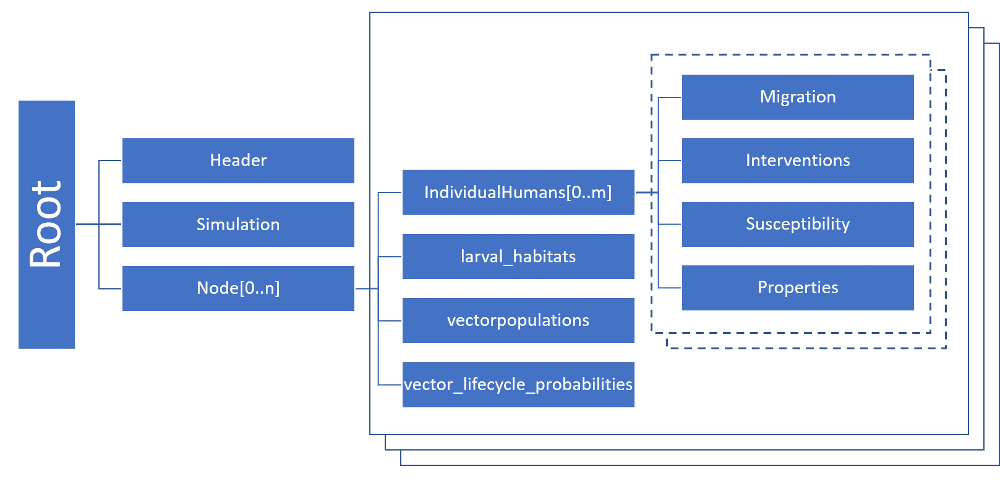

==========================
Serialized population file
==========================

To model a population with endemic disease, you cannot use a common  modeling technique in which you
introduce a disease outbreak to a naive population and analyze the immediate aftermath. Doing so
would  create a population missing the levels of natural immunity built up in the population due to
the history of exposure to the pathogen. Instead, you must run the simulation for a period of time
until the disease dynamics reach an equilibrium (aside from  :term:`stochastic` noise). This is
known as steady state. The simulation output prior to that point is disregarded.  This is a modeling
concept known as :term:`simulation burn-in`, borrowed from the electronics industry where the first
items produced by a manufacturing process are discarded before the process is applied.

However, the time necessary to run simulations until this point can be significant, especially for
large populations. Indeed, for endemic disease present at low absolute prevalence, you should
simulate a larger population size that allows a small number of infected individuals to be
represented.

|EMOD_s| avoids the need to run the burn-in period again and again with each simulation by using
serialization to save the population state after it reaches equilibrium. Then, when you  want to
begin a subsequent simulation investigating the outcome of a particular set of interventions, you
can begin the simulation at that point rather than needing to re-run the burn-in period. You can
serialize the population at multiple time steps during a simulation.

The serialized population files created are placed in the output directory and use the naming
convention  state-<timestep>.dtk. They are binary files that contain state information about every
agent in a simulation: their health status, age, property values, and more. These files can be consumed
by subsequent simulations to decrease run time.

.. note::

    If you used repeating interventions during the burn-in period, those interventions will not continue
    based on the information in the serialized population file. Check your campaign file for repeating
    interventions and reconfigure them as needed for the period after burn-in.

    Not every type of intervention can be serialized. Please see :doc:`parameter-campaign-individual-interventions`
    and :doc:`parameter-campaign-node-interventions` for information on which interventions can
    be serialized.

See :doc:`parameter-configuration-setup` parameters for more information on configuration. See
:doc:`software-serializing-pops` for more information on utilizing serialized populations in your
simulations.

File format
===========

Serialized population files are saved in JSON format. The file structure reflects the hierarchical
structure of the objects in Eradication.exe. Each file starts with a header and then contains
information about the simulation and the nodes. The following figure gives a rough overview of the
JSON file structure (note that only vector or malaria simulations will have larval habitats, vector
populations, or vector life cycles).

Internal state
--------------

The structure of a serialized population file reflects the relations of objects in a simulation. On
the highest level, a serialized population file contains a list with nodes, each node is the root of
a tree. At the configured timestep the simulation calls Node::serialize() which then calls the
serialized method of other members of this object. The Node class, for instance, contains a list with
individuals, each individual has certain attributes and a list of infections. Each infection has
certain attributes and might contain again a list of objects, etc. This continues until there are
no more objects.

All objects that are instantiated from classes that inherit from ISerializable and implement the
ISerializable interface can write itself to a buffer. It depends on the chosen writer how this
buffer is written and where it is written. Here we assume that a JSON writer is used and that the
writer adds variable names and formatting characters so that a valid JSON file is generated. A
similar mechanism is at play when a simulation is loaded again from a file. The names of variables
and their values are used to re-instantiate the same objects. Mind that |EMOD_s| is written in a compiled
language, so the description of data and objects (classes and variable types) in the source code
must match the data types in the serialized population file, e.g. if a variable is of type integer
changing its value to a float won’t have the anticipated effect.

Multi-core
----------

If the simulation is run on several cores, each core saves one file at the configured timestep(s).
To continue the simulation one |EMOD_S| file must be defined per node.

File Name
---------

The format for single core is: state-timestep.dtk e.g. state-00100.dtk

The format for multi-core is: state-timestep-core.dtk e.g. state-00100-001.dtk

Header
------
Each |EMOD_s| file starts with a header in JSON format that contains information about the data in the file.

Version 2 and 3

+----------------+---------------------------+------------------+----------------------------------------+
|  Magic Number  |  IDTK                     | 4 byte           |                                        |
+----------------+---------------------------+------------------+----------------------------------------+
| Header  Size   | 160                       | Integer          | Size of header in bytes                |
+----------------+---------------------------+------------------+----------------------------------------+

 Metadata

+----------------+---------------------------+------------------+----------------------------------------+
| Parameter      | Example                   | Type             | Description                            |
+================+===========================+==================+========================================+
| version        | 2/3                       | Integer          | Version number                         |
+----------------+---------------------------+------------------+----------------------------------------+
| date           | Day Mon day HH:MM:SS year | String           | A string                               |
+----------------+---------------------------+------------------+----------------------------------------+
| compressed     | True                      | Boolean          | Content compressed                     |
+----------------+---------------------------+------------------+----------------------------------------+
| engine         | LZ4                       | String           | Compression engine                     |
+----------------+---------------------------+------------------+----------------------------------------+
| bytecount      | 285140                    | Integer          | Total number of bytes in file          |
+----------------+---------------------------+------------------+----------------------------------------+
| chunkcount     | 3                         | Integer          | Number of chunks                       |
+----------------+---------------------------+------------------+----------------------------------------+
| chunksizes     | [368,141552,143220]       | List of Integers | List of chunk sizes                    |
+----------------+---------------------------+------------------+----------------------------------------+

Version 4

+----------------+---------------------------+------------------+----------------------------------------+
|  Magic Number  |  IDTK                     | 4 byte           |                                        |
+----------------+---------------------------+------------------+----------------------------------------+
| Header  Size   | 160                       | Integer          | Size of header in bytes                |
+----------------+---------------------------+------------------+----------------------------------------+

 Metadata

+----------------+---------------------------+------------------+----------------------------------------+
| Parameter      | Example                   | Type             | Description                            |
+================+===========================+==================+========================================+
| version        | 4                         | Integer          | Version number                         |
+----------------+---------------------------+------------------+----------------------------------------+
| date           | Day Mon day HH:MM:SS year | String           | A string                               |
+----------------+---------------------------+------------------+----------------------------------------+
| compression    | LZ4                       | NONE, LZ4, SNAPPY| Content compressed                     |
+----------------+---------------------------+------------------+----------------------------------------+
| bytecount      | 285140                    | Integer          | Total number of bytes in file          |
+----------------+---------------------------+------------------+----------------------------------------+
| chunkcount     | 3                         | Integer          | Number of chunks                       |
+----------------+---------------------------+------------------+----------------------------------------+
| chunksizes     | [368,141552,143220]       | List of Integers | List of chunk sizes                    |
+----------------+---------------------------+------------------+----------------------------------------+